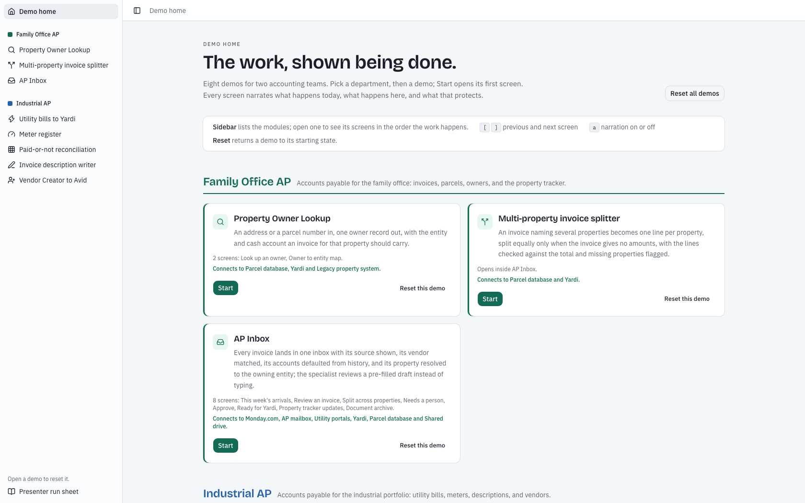
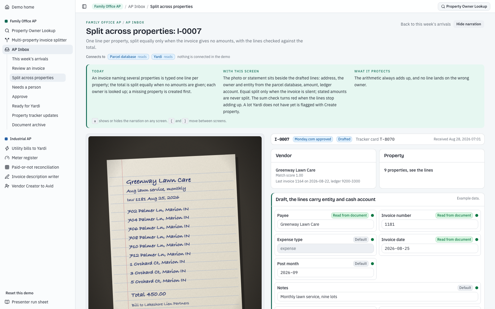
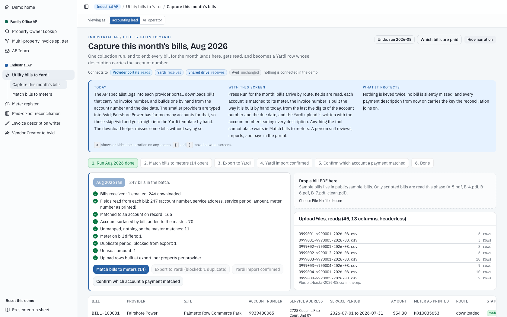
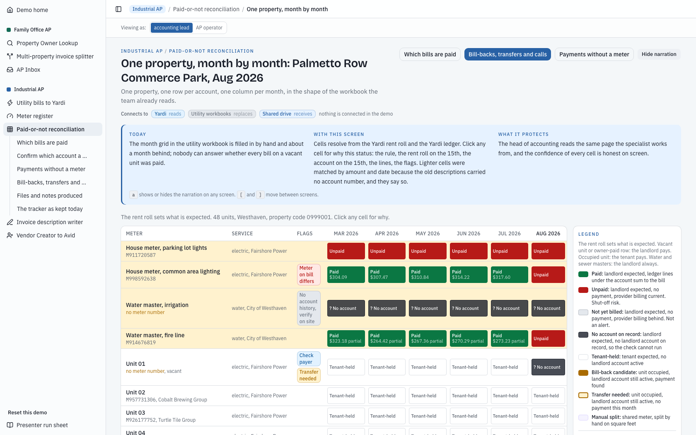
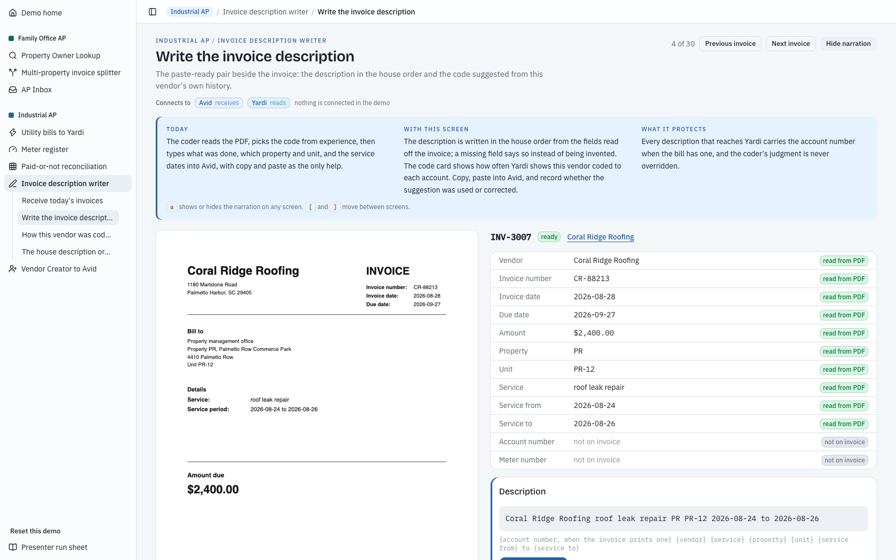

# AP Automation Demo Suite

A clickable prototype of accounts payable automation for a property management company: two AP teams, eight demo modules, thirty screens. Built with [Claude Code](https://claude.com/claude-code) as a discovery-stage prototype, to show each team its own work being done by software before anything was integrated.

**Try it live: [ap-automation-demo.keremakkiris.workers.dev](https://ap-automation-demo.keremakkiris.workers.dev)**. No sign-in; every visitor gets their own copy of the demo, and Reset all demos on Demo home starts it over. [docs/walkthrough.md](docs/walkthrough.md) says what to click.

> **Anonymized.** This is a public copy of a prototype built during a consulting engagement. The company, departments, people, providers, towns, and systems are fictional, every record comes from deterministic seed scripts, and the repository history starts fresh.



## My role

I ran discovery with both AP teams, turned what I heard into demo specs with numbered acceptance checks, made the product calls during the build, and directed Claude Code through each build session.

## The problem

- **Family Office AP** pays invoices for properties held across many holding companies. Invoices arrive four ways (email, a Monday.com approval, utility portals, and the post), and each one means typing ten fields into Yardi and looking up which holding company owns the property.
- **Industrial AP** pays the bills for a multi-tenant industrial portfolio. Utility bills are downloaded one portal at a time and carry no invoice number. Nobody can say whether every bill on a vacant unit was paid (the shut-off risk) or which tenant should be billed back. Every invoice description is typed by hand, and every new vendor is created twice, once in Yardi and again in Avid.

## What the demo shows

| Team | Module | What it does |
| --- | --- | --- |
| Family Office AP | Property Owner Lookup | An address or parcel number in, one owner out, with the entity and cash account the invoice should carry. |
| Family Office AP | AP Inbox | Every invoice lands in one inbox with its source shown, its vendor matched, its accounts defaulted from history, and its property resolved to the owner. The specialist reviews a pre-filled draft instead of typing. |
| Family Office AP | Multi-property invoice splitter | An invoice naming several properties becomes one line per property, split equally only when the invoice gives no amounts, and checked against the total. |
| Industrial AP | Utility bills to Yardi | The month's bills are read, matched to meters, and written as Yardi upload rows whose description carries the account number. |
| Industrial AP | Meter register | Every meter and the dated history of who held its account, keyed on the meter because account numbers change with every tenant. |
| Industrial AP | Paid-or-not reconciliation | Every meter, every month, checked against the rent roll: paid, unpaid, not yet billed, or a bill-back, with the shut-off risk on top. |
| Industrial AP | Invoice description writer | Writes each invoice description in the house order and suggests a GL code from the vendor's own history. The coder pastes it and keeps the judgment. |
| Industrial AP | Vendor Creator to Avid | A vendor is created once in Yardi. A nightly sync stages the gap for Avid and stops for a person when two names might be the same vendor. |

Every screen opens with a three-part narration (what happens today, what happens here, and what that protects) and a "Connects to" strip naming the systems it would read from or write to. Nothing is actually connected: Yardi, Avid, and Monday.com are stand-ins, import files are downloaded rather than imported, and "paid" is a simulation. [docs/walkthrough.md](docs/walkthrough.md) is the presenter's script for every module.

| | |
| --- | --- |
|  |  |
|  |  |

## Product decisions

- **A person stays in the loop.** The tool drafts, flags, and suggests. The specialist submits, the approver approves, and nothing is posted or paid automatically.
- **Code does the arithmetic; the model only reads.** Money math, matching, vacancy logic, and status rules are plain, tested code. Model steps only read a document and return checked fields, and each has a canned fallback, so the demo runs offline with no API key.
- **Honest confidence.** In AP Inbox every field shows where it came from: the document, the vendor's history, the parcel database, a default, or typing. In the reconciliation, payments matched by amount and date rather than by account number are drawn lighter and say so.
- **The meter is the key.** Account numbers change with every tenant; the meter does not, so the utility register is keyed on the meter.
- **Show the work, not vanity numbers.** No hours-saved counters, animated charts, or chat boxes. The utility demo runs two months so the audience watches the second month come out cleaner than the first.
- **The team's own words.** Screens are named for the step as the team describes it ("Which bills are paid", "Needs a person"), and no screen says model, pipeline, or API.

## How it was built with Claude Code

- **Specs first.** Each module began as a demo pack: a spec with the data profile, business rules, screens, demo flow, and numbered acceptance checks.
- **House rules.** [CLAUDE.md](CLAUDE.md) holds the rules every session built against: synthetic data markers, plain language, the design system, the module contract, and the hosting constraints.
- **A small team of agents.** AP Inbox, the invoice description writer, and the vendor sync were built in parallel, each by a pack coordinator that fans out to four specialist subagents defined in [.claude/agents](.claude/agents): a seed builder, a logic builder, a UI builder, and a rehearsal runner that writes one Playwright test per acceptance check. The coordinator runs up to three fix rounds.
- **Guardrails as code.** Seed generators are deterministic, byte-identical on every run. Scripts check identifier formats (account numbers start with 99, meter ids with M9), em dashes, and a leak guard for real names and figures whose lists live outside the repo.
- **Evidence.** The agent-built modules each keep a `STATUS.md` listing every acceptance check and how it was verified. The suite has 321 unit tests (Vitest) and 49 end-to-end tests (Playwright).
- **Hosting.** Deployed to Cloudflare Workers through OpenNext, with a Durable Object per browser session so every viewer gets their own demo state.

## Run it

Requires Node 20 or later.

```bash
npm install
npm run dev
```

Then open http://localhost:3000.

- `npm test` runs the unit tests. `npm run e2e` runs Playwright against a running dev server (run `npx playwright install chromium` once).
- `npm run check:markers`, `npm run check:dashes`, `npm run check:names`, and `npm run check:figures` are the hygiene checks.
- `npm run seed` and `npx tsx packs/<module>/seed/generate.ts` regenerate the data. `npm run screenshots` retakes the images in this README.
- Optional: set `ANTHROPIC_API_KEY` in `.env.local` (see `.env.example`) so model steps can read unscripted documents. Without it, every model step serves its canned output.
- `npm run cf:deploy` deploys to your own Cloudflare account, and `npx wrangler secret put DEMO_PASSPHRASE` puts the site behind a passphrase.

## Repository map

| Path | What is there |
| --- | --- |
| `app/` | Next.js routes: the `/<department>/<module>/<screen>` pages and their API routes |
| `packs/<module>/` | One folder per module: rules and unit tests (`lib/`), store, screens (`ui/`), seed generator and data (`seed/`), Playwright specs (`e2e/`) |
| `components/shell/` | Sidebar, breadcrumb, narration, the "Connects to" strip, and the design kit |
| `data/` | The utility seed and the narration for every screen |
| `scripts/` | Seed generators, sample bills, screenshots, and hygiene checks |
| `docs/` | The walkthrough, the utility run sheet, and screenshots |
| `.claude/agents/` | The subagents that built the modules |
| `worker.ts`, `wrangler.jsonc` | Cloudflare Workers entry point and configuration |

Stack: Next.js 16, React 19, TypeScript, Tailwind CSS 4, shadcn/ui, Zod, pdf-lib, Vitest, Playwright, Cloudflare Workers.
